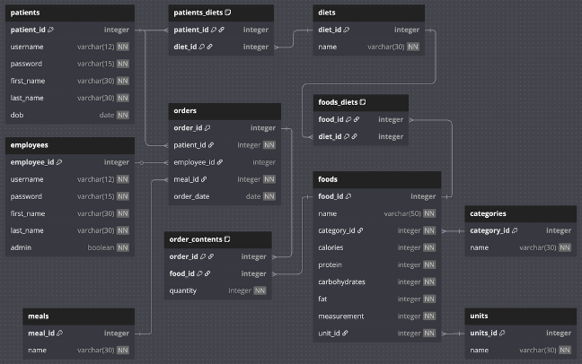

# Hospital Dietary Management System
> A project by Luis Jaco
> Developed as a final project for CSCI 300: Database Management

The **Hospital Dietary Management System** is a **Java**-based application designed to manage patient dietary records and enforce diet-specific food restrictions. This system ensures that patients are restricted to meal options which align with their prescribed dietary requirements (e.g. renal, diabetic, clear liquid, regular). 


## Features
- **Dietary Restriction Enforcement**: Patients can only see and insert meal options which align to their current prescribed dietary requirements.
- **Patient Meal Management**: Allows patients to create meals which stay within their dietary restrictions in an organized manner.
- **Nutritional Tracking**: Calories and macronutrients (fat, protein, carbohydrates) are stored and tracked between meal items.
- **Patient Meal History**: Patients are freely able to retrieve their past orders to find meal items and see nutritional information.

## System Design
Leveraging **MySQL** and **Java Database Connectivity (JDBC)**, the **Hospital Dietary Management System** communicates to a **3NF** relational database to store:
- Patient information
- Dietary restrictions
- Meal item information (name, calories, protein, fat, carbohydrates, diet restriction clearance)
- Order history

## Database Schema


## Usage
```java
import tools.Menu;
public class Main {
    public static void main(String[] args) {
        // 1. input MySQL server information.
        String url = "jdbc:mysql://127.0.0.1:3306/...";
        String user = "root";
        String password = "...";

        // 2. Initialize a new Menu class.
        Menu menu = new Menu();
        menu.setup(url, user, password);
        
        // 3. Simply use run() to being using the Hospital Dietary Management System.
        menu.run();
    }
}
```

## License
[MIT](https://choosealicense.com/licenses/mit/)
